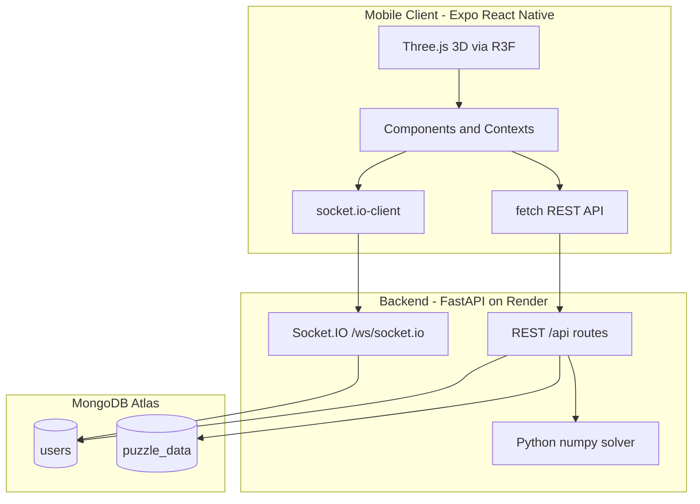

# Ubongo3dMobile

This application was created as a learning project for the **Full Stack Open** course (fullstackopen.com).

The project is heavily inspired by Grzegorz Rejchtman's **UBONGO 3D** board game and is designed to be used alongside the original puzzle pieces from the game. Rather than replacing the physical game, this application extends it by allowing players to compete online while using the real puzzle pieces.

One intentional difference from the original game is that every player receives the **exact same puzzle board** each round. This ensures that the board layout itself cannot be blamed for the outcome, making the competition focus purely on solving speed and skill.

The project combines a React Native / Expo client with a FastAPI backend, MongoDB Atlas database, and real-time multiplayer over Socket.IO. Players can solve puzzles alone in classic 2D or interactive 3D mode, compete head-to-head with friends, manage a social lobby, and progress through an XP / level system.

Beyond the software, the project involved hand-drawn background art, iterative visual design, and extensive playtesting with friends to refine gameplay and fix issues based on user feedback. 

**Live backend:** [https://fs-projekti-ubongo.onrender.com](https://fs-projekti-ubongo.onrender.com)  
**Mobile builds:** EAS Build (preview APK with production API URLs baked in)

> **Disclaimer:** This project is an unofficial fan-made educational project. All rights to the original UBONGO 3D game belong to its respective creators and publishers.

# AI Usage Disclosure

AI assistance was used only for:

- Helping successfully configure and publish the application using Expo Application Services (EAS), AI was not used for the actual software development work but just to overcome this final hurdle.
- Assisting with writing and polishing this `README.md`.

The application's code and overall implementation were developed solely without AI code generation. As a result, the repository may be less polished or organized than projects built with extensive AI assistance, which I find expected for a student's first large-scale software project :)

---

## Table of Contents

1. [Architecture](#architecture)
2. [Tech Stack and Learning Outcomes](#tech-stack-and-learning-outcomes)
3. [CRUD and Data Operations](#crud-and-data-operations)
4. [Unique Features Beyond Boilerplate](#unique-features-beyond-boilerplate)
5. [Real-Time Socket Protocol](#real-time-socket-protocol)
6. [Database Schema](#database-schema)
7. [Challenges and Debugging](#challenges-and-debugging)
8. [Running the Project](#running-the-project)
9. [Project Structure](#project-structure)
10. [Known Limitations](#known-limitations)

---

## Architecture




**Request flow (typical session):**

1. User signs in via `POST /api/token` → JWT stored in AsyncStorage.
2. `UserContext` loads profile via `GET /api/users/me/`.
3. Single-player: `GET /api/puzzle` returns blocks + precomputed solutions.
4. Multiplayer: Socket.IO room created from sorted usernames; host shares puzzle via `data` event; game state synced in real time.
5. Score updates persisted via `PUT /api/users/me/updateScore/...` and win records via `PUT /api/users/me/wins/{friend}`.

---

## Tech Stack and Learning Outcomes

### Frontend (`frontend/`)


| Technology                                    | Role                         | Key files                                 |
| --------------------------------------------- | ---------------------------- | ----------------------------------------- |
| React Native 0.72 + Expo 49                   | Cross-platform mobile app    | `App.js`, `app.config.js`                 |
| Expo dev client + EAS Build                   | Development and distribution | `eas.json`                                |
| React Context (7 providers)                   | Global state without Redux   | `App.js`, `src/contexts/`                 |
| react-router-native                           | Screen navigation            | `Main.jsx`                                |
| @react-three/fiber + three                    | 3D voxel puzzle rendering    | `Matrix3D.jsx`, `Blocks3D.jsx`            |
| socket.io-client                              | Real-time multiplayer        | `services/socket.js`, `SocketContext.js`  |
| fetch                                         | REST API calls               | `services/users.js`, `services/puzzle.js` |
| Formik + Yup                                  | Sign-in / sign-up forms      | `Sign.jsx`                                |
| AsyncStorage                                  | JWT persistence              | `utils/authStorage.js`                    |
| react-native-animatable, Lottie, expo-haptics | UI polish and feedback       | `Score.jsx`, `Animations.jsx`             |


### Backend (`backend_python/`)


| Technology              | Role                        | Key files                              |
| ----------------------- | --------------------------- | -------------------------------------- |
| FastAPI                 | REST API                    | `main.py`, `routes.py`                 |
| fastapi_socketio        | WebSocket multiplayer       | `main.py`                              |
| MongoDB Atlas + pymongo | Persistent storage          | `pymongo_get_database.py`, `routes.py` |
| python-jose + passlib   | JWT auth + bcrypt passwords | `services.py`, `config.py`             |
| NumPy                   | 3D puzzle solver            | `solver.py`, `components.py`           |
| Pydantic                | Request/response models     | `services.py`                          |


### Deployment


| Component                | Platform                     | Configuration                                                 |
| ------------------------ | ---------------------------- | ------------------------------------------------------------- |
| Backend API + WebSockets | [Render](https://render.com) | `https://fs-projekti-ubongo.onrender.com`                     |
| Database                 | MongoDB Atlas                | `ATLAS_URI` in `.env`                                         |
| Mobile app               | EAS Build                    | `eas.json` preview profile → APK with `APOLLO_URI` / `WS_URL` |


Environment variables (frontend via `app.config.js`, backend via `.env`):

- `APOLLO_URI` — REST API base URL (defaults to Render)
- `WS_URL` — WebSocket base URL (defaults to Render WSS)
- `ATLAS_URI` — MongoDB connection string
- `JWT_SECRET`, `JWT_ALGORITHM` — token signing
- `DB_NAME` — MongoDB database name

---

## CRUD and Data Operations

The app does not expose generic REST CRUD for every entity. Instead, it implements **Create, Read, Update, and Delete patterns** tailored to users, social graphs, and puzzle content. This section maps those operations explicitly because they were a core part of the full-stack learning goals.

### Users


| Operation  | Endpoint                                              | Auth       | Frontend                               |
| ---------- | ----------------------------------------------------- | ---------- | -------------------------------------- |
| **Create** | `POST /api/signup`                                    | No         | `Sign.jsx` → `users.js:signUp()`       |
| **Read**   | `POST /api/token`                                     | No         | `Sign.jsx` → `users.js:signIn()`       |
| **Read**   | `GET /api/users/me/`                                  | Bearer JWT | `UserContext.js` → `readUsersMe()`     |
| **Read**   | `GET /api/users/me/lobby`                             | Bearer JWT | Same handler as `/me`                  |
| **Update** | `PUT /api/users/me/updateScore/{xp}/{level}/{streak}` | Bearer     | `Game3dContext.js` after puzzle solve  |
| **Update** | `PUT /api/users/me/avatar`                            | Bearer     | `Profile.jsx` → `uploadAvatar()`       |
| **Update** | `PUT /api/users/me/wins/{friend}`                     | Bearer     | `GameContext.js`, `Online3DContext.js` |


New users are created with default avatar (base64 JPEG), empty friend lists, and zero XP/level/streak (`routes.py` signup handler).

### Friends and Friend Requests


| Operation  | Endpoint                                       | Description                                  |
| ---------- | ---------------------------------------------- | -------------------------------------------- |
| **Create** | `PUT /api/users/me/sentRequests/{request}`     | Send friend request; auto-accepts if mutual  |
| **Read**   | Embedded in user document                      | `friends`, `requests`, `sentRequests` arrays |
| **Read**   | `GET /api/friend/{friend}`                     | Load friend profile for head-to-head stats   |
| **Update** | Mutual accept via sentRequests handler         | Moves both users into each other's `friends` |
| **Update** | `PUT /api/users/me/wins/{friend}`              | Records win/loss on both players             |
| **Delete** | `PUT /api/users/me/deleteFriend/{friend}`      | Removes friendship both ways (`$pull`)       |
| **Delete** | `PUT /api/users/me/deleteSentRequest/{friend}` | Cancel outgoing request                      |
| **Delete** | `PUT /api/users/me/deleteRequest/{friend}`     | Reject incoming request                      |


Avatar updates propagate to embedded friend/request documents across multiple users via targeted `update_many` with positional `$` operator (`routes.py` upload_avatar).

### Puzzle Data


| Operation  | Endpoint                    | Description                                                             |
| ---------- | --------------------------- | ----------------------------------------------------------------------- |
| **Create** | `POST /api/upLoadBlocks`    | Admin seeding: runs Python solver, stores blocks + solutions in MongoDB |
| **Read**   | `GET /api/puzzle`           | Returns random puzzle (blocks + color-coded solution grids)             |
| **Update** | `$addToSet` in upLoadBlocks | Appends new block/solution combinations to existing boards              |


Puzzles are **precomputed offline** by the solver and served read-only during gameplay — the client never solves puzzles at runtime in production.

### Avatars


| Operation  | Flow                                                                                      |
| ---------- | ----------------------------------------------------------------------------------------- |
| **Create** | User picks image from phone gallery (`expo-image-picker`)                                 |
| **Read**   | Base64 string stored in user and embedded friend docs                                     |
| **Update** | `PUT /api/users/me/avatar` updates self + all references in friends/requests/sentRequests |


### Frontend Service Layer

- `frontend/src/services/users.js` — all user/friend REST calls
- `frontend/src/services/puzzle.js` — `GET /api/puzzle`
- `frontend/src/services/board.js` — stub CRUD for boards (no backend routes implemented; unused)

---

## Unique Features Beyond Boilerplate

These are the distinguishing implementations that go beyond a basic tutorial or starter template.

### 1. Custom 3D Puzzle Engine (Python + NumPy)

Sixteen polyomino piece types (`r1–r4`, `g1–g4`, `y1–y4`, `b1–b4`) are defined with 3D coordinates in `backend_python/components.py`. The solver (`solver.py`):

- Stacks a 2D board pattern into a 3D binary matrix
- Permutes 4-piece combinations from the piece pool
- Applies rotation variants and validates placements
- Returns up to five color-coded solution grids per board

Solutions are batch-generated via `POST /api/upLoadBlocks` and stored in MongoDB for fast client delivery.

### 2. Dual Game Modes (2D Classic + 3D Voxel)


| Mode       | Component                                 | Interaction                                                 |
| ---------- | ----------------------------------------- | ----------------------------------------------------------- |
| Classic 2D | `SinglePlayer2D.jsx`, `MultiPlayer.jsx`   | Hint grid, block images, touch placement                    |
| 3D voxel   | `SinglePlayer3D.jsx`, `MultiPlayer3D.jsx` | React Three Fiber canvas; tap cells to place selected block |


3D validation uses precomputed rotation lookup tables (`BlockRotations.js`) and coordinate padding (`PadBlock.js`) in `Game3dContext.js`.

### 3. Real-Time 1v1 Multiplayer

Socket.IO rooms are keyed by sorted usernames (`socket_services.py:make_room_id`). Separate flows exist for 2D and 3D:

- **2D** (`MultiPlayer.jsx`, `GameContext.js`) — manual UBONGO claim, contest, prove phase
- **3D** (`MultiPlayer3D.jsx`, `Online3DContext.js`) — auto-win when all blocks validated, mutual give-up for rematch

Room state (host, blocks, solutions, ready flags, give-up flags) lives in an in-memory dict on the server (`main.py:current_rooms`).

### 4. 2D Dispute System (Anti-Cheat Social Mechanic)

When a player claims victory in 2D multiplayer:

1. Triple-tap **UBONGO** to announce win
2. Opponent gets a **6-second contest window** to challenge
3. Winner enters a **20-second prove phase** — colors the grid to demonstrate the solution
4. Client validates colored grid against server-provided `puzzle.solutions`

Implemented in `GameContext.js` with socket events `ubongo`, `contest`, `contest_result`.

### 5. 3D Multiplayer Give-Up and Rejoin

- Each player can give up; when **both** give up, server emits `bothGaveUp` and loads a new puzzle
- Leave/rejoin logic preserves room state so players can exit and return (`SocketContext.js`)
- Documented edge case: closing the entire app may allow rejoining the same room in a different mode

### 6. Social Lobby with Real-Time Notifications

`Lobby.jsx` uses a collapsible accordion UI for:

- Incoming and outgoing game invites (2D or 3D mode)
- Friend list with head-to-head W/L
- Pending and sent friend requests

Socket channel `{username}/post` delivers invite, accept, request, and cancel events to `UserContext.js` for immediate UI updates without polling.

### 7. Gamification System


| Mechanic      | Implementation                                            |
| ------------- | --------------------------------------------------------- |
| XP            | Base score + speed bonus (faster solves earn more)        |
| Speed formula | `1000 - time×5` if ≤180s, else `max(1, 100 - time)`       |
| Streak        | Single-player 3D: multiplier up to 5× consecutive solves  |
| Level curve   | `50×level² + 2000×level + 500` XP per level (`Score.jsx`) |
| Head-to-head  | `wins` / `loses` username arrays on user documents        |


Animated progress bar and level-up bounce effects in `Score.jsx`.

### 8. JWT Authentication Flow

- OAuth2 password grant (`POST /api/token`)
- bcrypt password hashing on signup
- 7-day token expiry (`config.py:ACCESS_TOKEN_EXPIRE_MINUTES`)
- Protected routes via FastAPI `Depends(get_current_active_user)`
- Token stored in AsyncStorage, attached as `Authorization: Bearer` header

### 9. Asset Preloading Context

`AssetsContext.js` preloads at startup:

- Custom font (FreckleFace)
- 16 block images + 64 color variation images
- Hand-drawn UI paints, cave-wall background, win/lose fullscreen effects

Prevents stutter during gameplay from on-demand image loading.

### 10. Custom Visual Identity

- Hand-drawn cave-wall background (`assets/backGround/caveWall.png`)
- Painted menu button backgrounds (`assets/paints/`)
- Dark theme throughout (`userInterfaceStyle: "dark"`)
- Transparent overlay components over background imagery
- Green/red fullscreen effects on win/lose

---

## Real-Time Socket Protocol

All events use Socket.IO at path `/ws/socket.io` on the same host as the REST API.


| Client emits     | Server handler          | Server broadcasts              | Purpose                               |
| ---------------- | ----------------------- | ------------------------------ | ------------------------------------- |
| `join`           | `handle_join`           | `room` → joiner                | Enter game room, sync state           |
| `leave`          | `handle_leave`          | `userLeft`                     | Leave room, swap host if needed       |
| `host`           | `handle_host`           | —                              | Reassign room host                    |
| `userRedy`       | `handle_redy`           | `redy` (when both ready)       | Ready-up before game start            |
| `data`           | `handle_data`           | `game_data`                    | Host shares puzzle blocks + solutions |
| `loading`        | `handle_loading`        | `loading`                      | Sync loading state                    |
| `ubongo`         | `handle_ubongo`         | `ubongo`                       | Player claims victory                 |
| `contest`        | `handle_contest`        | `contested`                    | Challenge opponent's win (2D)         |
| `contest_result` | `handle_result`         | `contestResult`                | Prove-phase result (2D)               |
| `userGiveUp`     | `handle_give_up`        | `friendGaveUp` or `bothGaveUp` | Give up (3D)                          |
| `invite`         | `handle_invite`         | `{friend}/post`                | Game invite with mode (2D/3D)         |
| `cancel_invites` | `handle_cancel_invites` | `{friend}/post`                | Cancel pending invite                 |
| `accept`         | `handle_accept`         | `{friend}/post`                | Accept invite (socket side)           |
| `request`        | `handle_request`        | `{friend}/post`                | Friend request notification           |


Room ID format: `{userA}-{userB}` with usernames sorted alphabetically.

---

## Database Schema

**Database:** MongoDB Atlas (database name from `DB_NAME` env var, default `"base"` in `pymongo_get_database.py`)

### Collection: `users`

```json
{
  "username": "string",
  "hashed_password": "string",
  "friends": [{ "username", "avatar", "wins", "loses", "level", "xp" }],
  "requests": [{ "username", "avatar", "wins", "loses", "level", "xp" }],
  "sentRequests": [{ "username", "avatar", "wins", "loses", "level", "xp" }],
  "wins": ["username", "..."],
  "loses": ["username", "..."],
  "lobby": "string",
  "xp": 0,
  "level": 0,
  "streak": 0,
  "avatar": "base64 string",
  "disabled": null,
  "sentInvite": ["username"],
  "invites": ["username"]
}
```

Pydantic models: `User`, `Friend`, `UserInDB` in `services.py`.

### Collection: `puzzle_data`

```json
{
  "board": [[x, y], "..."],
  "data": [
    {
      "blocks": ["r1", "g2", "y3", "b4"],
      "solutions": [
        [["red", "green", "..."], "..."],
        "..."
      ]
    }
  ]
}
```

### Collection: `own_boards` / `own_solutions`

Used internally by the `upLoadBlocks` seeding pipeline; not exposed via public REST endpoints.

### In-Memory (not persisted)

Socket room state in `main.py`:

```python
{
  "host": "",
  "solutions": [],
  "blocks": [],
  "hostRedy": False,
  "playerRedy": False,
  "hostGaveUp": False,
  "playerGaveUp": False
}
```

---

## Running the Project

### Prerequisites

- Node.js 18+
- Python 3.10+
- Expo account (for EAS builds)
- MongoDB Atlas cluster (for backend)
- Android device or emulator (for mobile testing)

### Backend (local)

```bash
cd backend_python
pip install -r requirements.txt
```

Create `backend_python/.env`:

```env
ATLAS_URI=mongodb+srv://...
JWT_SECRET=your-secret
JWT_ALGORITHM=HS256
DB_NAME=base
```

```bash
uvicorn main:app --reload --host 0.0.0.0 --port 8000
```

API docs available at `http://localhost:8000/docs`.

### Frontend (development)

```bash
cd frontend
npm install
npx expo start --dev-client
```

The dev client loads JavaScript from Metro on your local machine (same Wi-Fi required). API calls default to the Render production URL unless you override `APOLLO_URI` in a `.env` file.

### Production mobile build (works off-LAN)

```bash
cd frontend
npx eas-cli build --profile preview --platform android
```

The preview profile in `eas.json` sets `APOLLO_URI` and `WS_URL` to the Render host. Install the resulting APK on any device with internet access — no local server needed.

### Seeding puzzle data (admin)

```bash
curl -X POST https://fs-projekti-ubongo.onrender.com/api/upLoadBlocks
```

Runs the solver against boards in `own_boards` and populates `puzzle_data`. This is a long-running operation intended for development/setup.

---

## Project Structure

```
Ubongo3dMobile/
├── README.md
├── backend_python/
│   ├── main.py              # FastAPI app, Socket.IO handlers, room state
│   ├── routes.py            # REST endpoints (auth, users, puzzles)
│   ├── services.py          # Pydantic models, JWT, password hashing
│   ├── solver.py            # NumPy 3D puzzle solver
│   ├── components.py        # Piece definitions and colors
│   ├── config.py            # Environment configuration
│   ├── socket_services.py   # Room ID helpers
│   └── pymongo_get_database.py
│
└── frontend/
    ├── App.js               # Provider tree and app entry
    ├── app.config.js        # Expo config, API URLs
    ├── eas.json             # EAS build profiles
    └── src/
        ├── components/      # Screens and UI (Menu, Lobby, MultiPlayer, Matrix3D, ...)
        ├── contexts/        # React Context providers (User, Game, Socket, ...)
        ├── services/        # REST and socket clients
        ├── tools/           # Block rotation and padding utilities
        ├── hooks/           # Custom hooks
        ├── utils/           # Auth storage
        └── lotties/         # Lottie animation assets
```

### Frontend Routes


| Path                             | Screen                                      |
| -------------------------------- | ------------------------------------------- |
| `/`                              | Main menu                                   |
| `/SinglePlayerMenu`              | 2D vs 3D picker                             |
| `/SinglePlayer2D`                | Solo classic mode                           |
| `/SinglePlayer3D`                | Solo 3D mode                                |
| `/MultiPlayer`                   | 2D vs friend                                |
| `/MultiPlayer3D`                 | 3D vs friend                                |
| `/Lobby`                         | Friends, invites, requests                  |
| `/SignIn`, `/SignUp`, `/SignOut` | Authentication                              |
| `/profile`                       | User profile and avatar                     |
| `/Friend`                        | Friend profile and stats                    |
| `/boardWrite`                    | Dev board editor (not connected to backend) |


---

## Known Limitations

- **No automated tests** — Jest is configured in `package.json` but no test files exist; backend has no test suite.
- **Render free tier** — Backend spins down after inactivity; first request may be slow (cold start).
- **Rejoin edge case** — Closing the app entirely may allow rejoining a room in a different game mode; documented as acceptable behavior.
- **In-memory room state** — Socket rooms are lost on server restart; not persisted to MongoDB.

---

## Non-Software Work

- **Visual design:** Hand-drawn background images and painted UI button assets
- **Playtesting:** Regular test sessions with friends to identify bugs and UX issues
- **Iteration:** Features trimmed based on playtest feedback to focus on core gameplay
- **Gamification design:** XP curves, streak mechanics, and level progression tuned for engagement

