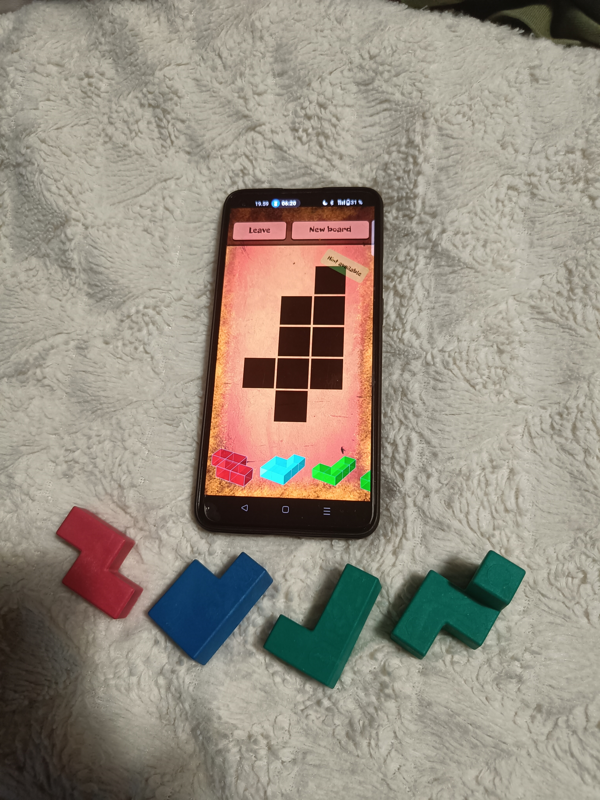
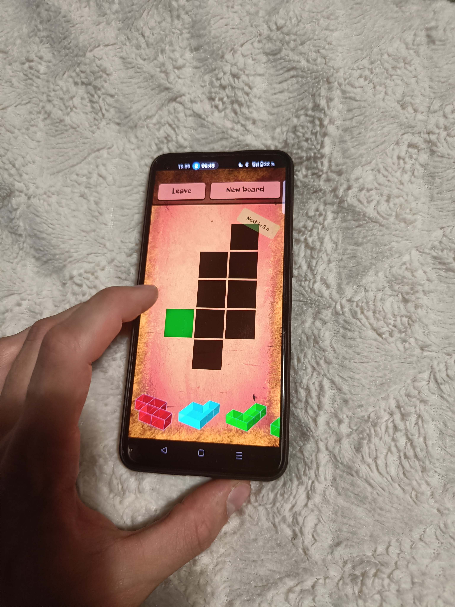
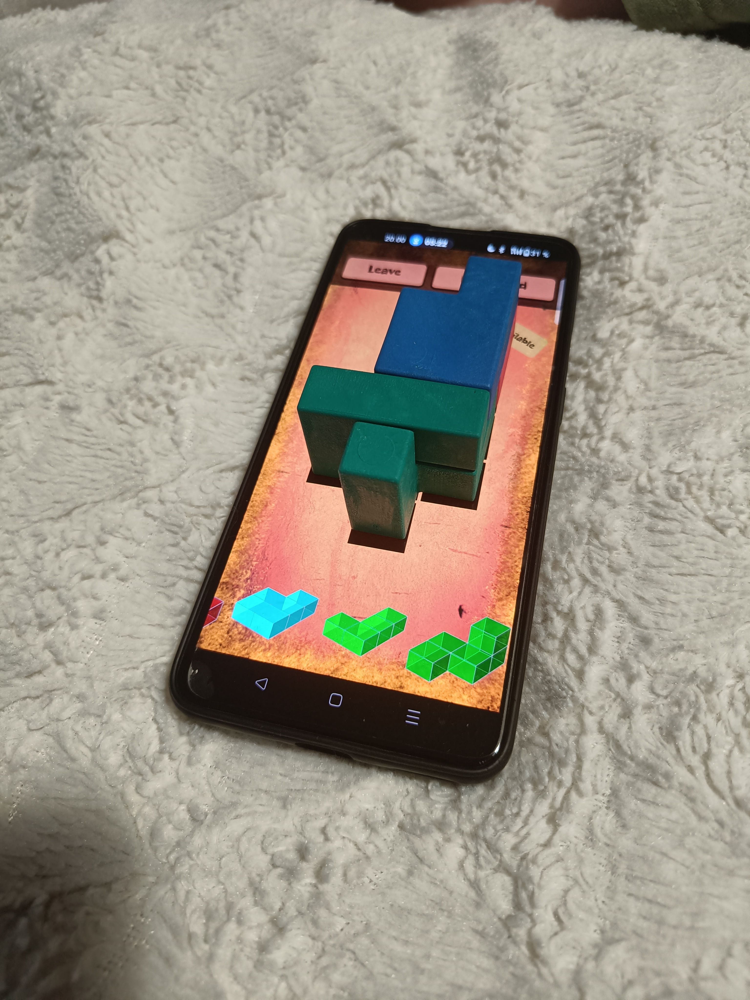
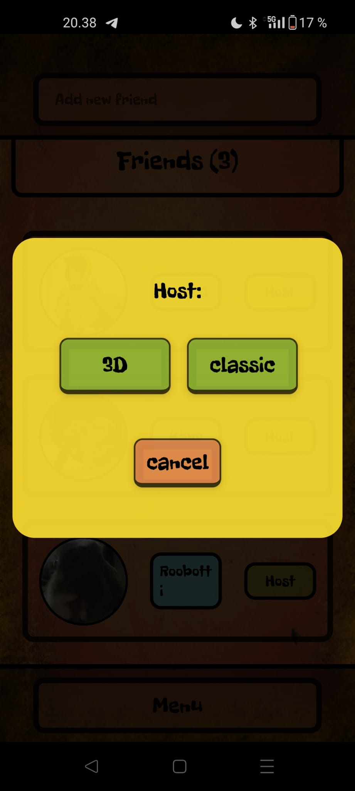
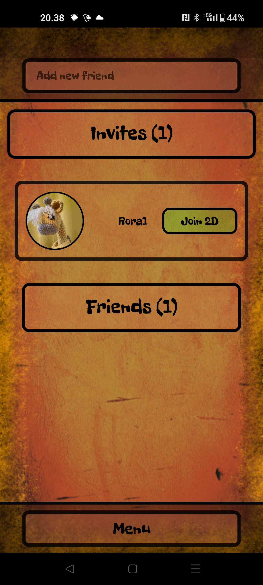
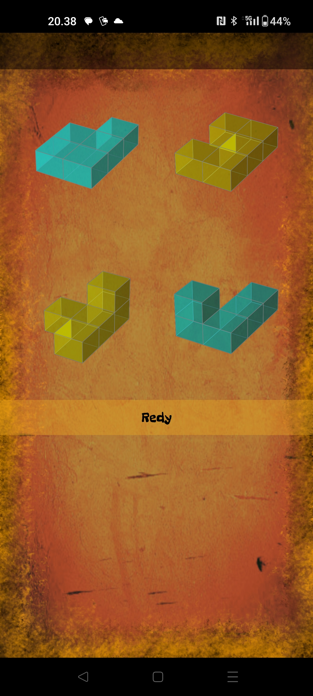
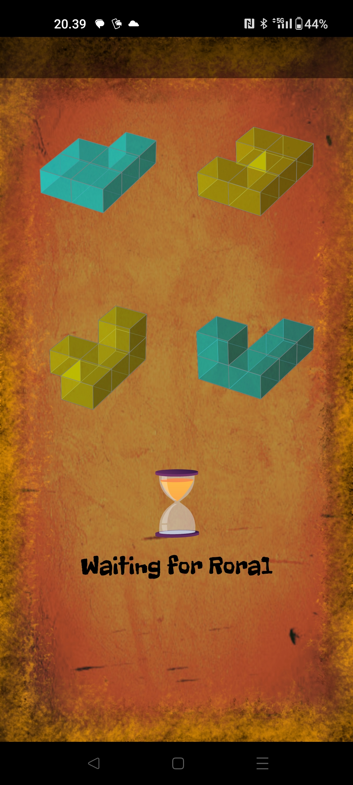
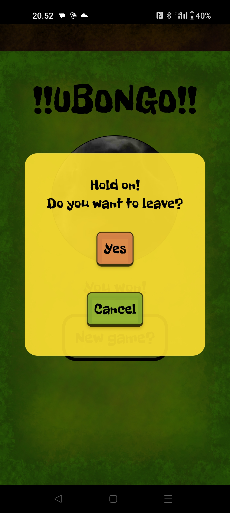
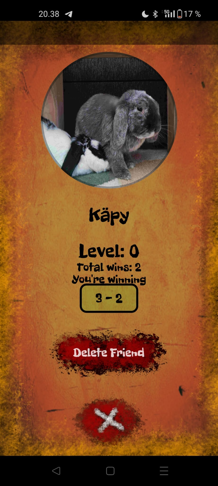

# Ubongo Guide

Welcome! This guide walks you through the app and its main features.

## Getting started

To access most of the exciting features, you need to **sign up**. The game really shines when you have the physical Ubongo 3D blocks and a friend to play against.

The 3D puzzles are challenging — most players rely on the physical blocks to solve them. Only someone with strong spatial reasoning tends to solve them on screen alone.

---

## Game modes

There are two ways to play:

### 1. Classic mode

The screen acts as the board. Tap a cell to see which color belongs in that spot, then place your blocks to complete the puzzle.

<figure style="margin: 0; text-align: center;">
  <figcaption style="font-weight: 600; margin-bottom: 0.5rem;">Gather the blocks</figcaption>
  
</figure>

<figure style="margin: 0; text-align: center;">
  <figcaption style="font-weight: 600; margin-bottom: 0.5rem;">Click for a hint</figcaption>
  
</figure>

<figure style="margin: 0; text-align: center;">
  <figcaption style="font-weight: 600; margin-bottom: 0.5rem;">Complete the puzzle</figcaption>
  
</figure>

### 2. 3D mode

Tap the screen to fill in blocks. Correctly placed blocks become more opaque. When every block is in the right place, you complete the puzzle.

<figure style="margin: 1rem 0; text-align: center;">
  <figcaption style="font-weight: 600; margin-bottom: 0.5rem;">3D mode demo</figcaption>
  <video width="560" height="315" controls style="border-radius: 0.5rem; max-width: 100%;">
    <source src="images/VID_20260726203647.mp4" type="video/mp4">
    Your browser does not support the video tag.
  </video>
</figure>

---

## Multiplayer

Log in, add a friend, and invite them to a game. You can choose Classic or 3D mode.

<figure style="margin: 0; text-align: center;">
  <figcaption style="font-weight: 600; margin-bottom: 0.5rem;">Hosting a match</figcaption>
  
</figure>

<figure style="margin: 0; text-align: center;">
  <figcaption style="font-weight: 600; margin-bottom: 0.5rem;">Joining a match</figcaption>
  
</figure>

Once both players are ready, the game begins.

In Classic mode, tap the **UBONGO** button several times after solving the puzzle — the repeated taps prevent accidental confirmations.

If the loser suspects the winner did not actually solve the puzzle, they can **challenge** the result. The winner must then match the puzzle colors on screen within the time limit to prove they solved it.

You can forfeit at any time by using your phone's back button and confirming that you want to leave.

<figure style="margin: 0; text-align: center;">
  <figcaption style="font-weight: 600; margin-bottom: 0.5rem;">Ready</figcaption>
  
</figure>

<figure style="margin: 0; text-align: center;">
  <figcaption style="font-weight: 600; margin-bottom: 0.5rem;">Wait</figcaption>
  
</figure>

<figure style="margin: 0; text-align: center;">
  <figcaption style="font-weight: 600; margin-bottom: 0.5rem;">Quit?</figcaption>
  
</figure>

---

## Profile & stats

Tap your profile picture to change it. Tap a friend's profile to view head-to-head statistics.

<figure style="margin: 1rem 0; text-align: center;">
  <figcaption style="font-weight: 600; margin-bottom: 0.5rem;">Add profile picture</figcaption>
  
</figure>
